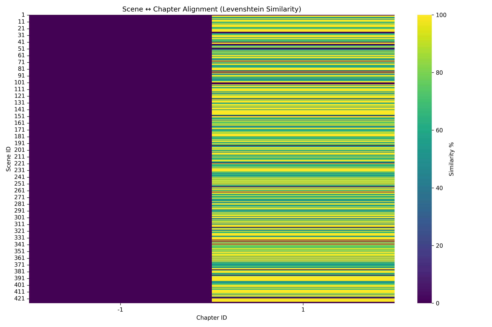
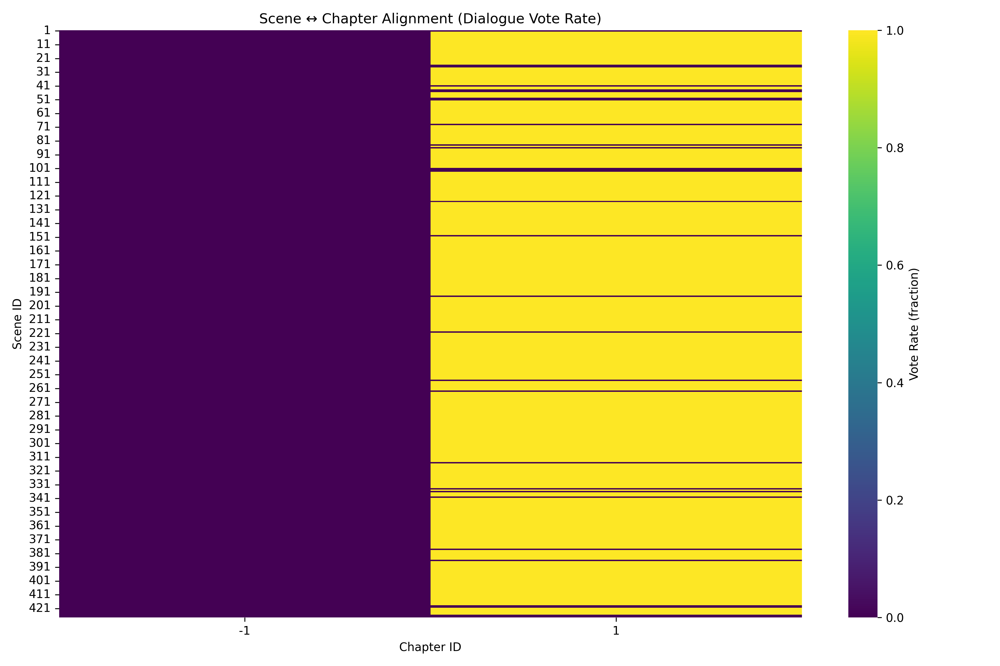
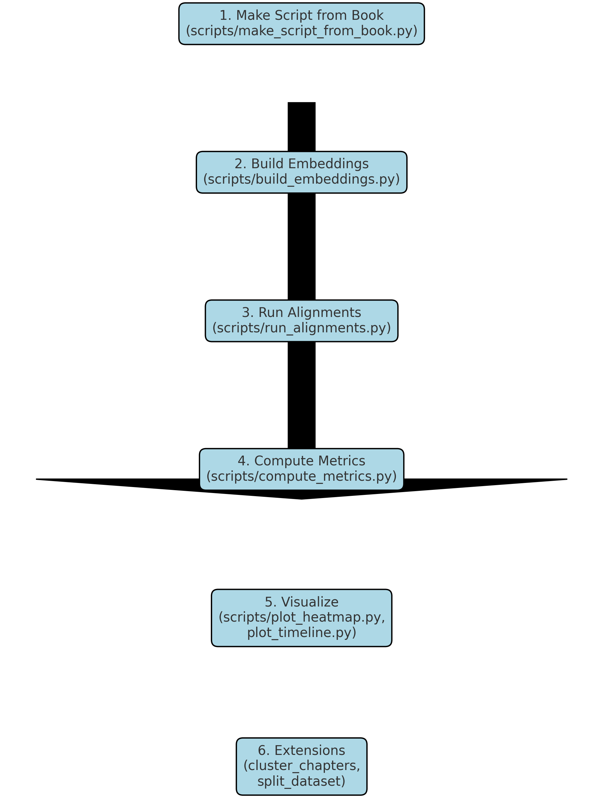

# Scene2Chapter NLP Aligner 📖🎬

[](https://www.python.org/)  
[]()  
[](LICENSE)  

> **Automatically align movie scripts (scenes) with novel chapters using modern NLP.**  
This toolkit combines semantic embeddings, edit-distance similarity, and dynamic programming to map screenplay scenes to corresponding book chapters.

---

## ✨ Features

- **SBERT Cosine Similarity** – Embedding-based semantic alignment (fast & robust).  
- **Dialogue-Level Edit Distance** – Levenshtein & Hamming similarity for fine-grained matching.  
- **Dialogue Voting Mechanism** – Measures how consistently scene dialogues agree on their chapter alignment.  
- **Monotonic Dynamic Programming** – Order-preserving alignment across the entire narrative.  
- **Metrics & Evaluation** – Dialogue counts, average similarity, vote rates, high-confidence matches.  
- **Visualizations** – Heatmaps for similarity and vote rate, plus alignment statistics.  
- **Extensible** – Swap in new embeddings (e.g., OpenAI, multilingual SBERT) or richer features (BookNLP).

---

## 📂 Project Structure

```
Scene2Chapter-NLP-Aligner/
├─ README.md
├─ pyproject.toml
├─ align/
│  ├─ parsing.py              # Parse scripts & books into structured objects
│  ├─ normalize.py            # Normalize text, extract dialogue spans
│  ├─ metrics.py              # Similarity functions (cosine, Levenshtein, Hamming, Jaccard)
│  ├─ sbert.py                # SBERT embedding encoder
│  ├─ align_agg_cosine.py     # Scene↔Chapter embedding alignment
│  ├─ align_dialogue_edit.py  # Dialogue-level Levenshtein/Hamming alignment + voting
│  ├─ align_monotonic.py      # Dynamic programming refinement
│  ├─ evaluate.py             # Compute dataset-wide metrics
│  └─ io_formats.py           # CSV/TXT IO helpers
├─ scripts/
│  ├─ make_script_from_book.py # Generate pseudo-script from raw book
│  ├─ build_embeddings.py      # Warm up SBERT embeddings
│  ├─ run_alignments.py        # Run all alignment methods + save results
│  ├─ compute_metrics.py       # Compute summary metrics from results
│  └─ plot_heatmap.py          # Visualize similarity / vote rate heatmaps
└─ tests/
   └─ test_sanity.py
```

---

## ⚡ Installation

```bash
git clone https://github.com/parthamehta123/Scene2Chapter-NLP-Aligner.git
cd Scene2Chapter-NLP-Aligner

# Install dependencies
pip install -U pip
pip install -r requirements.txt
```

Requirements include:
- `sentence-transformers`
- `rapidfuzz`
- `python-Levenshtein`
- `numpy`, `pandas`, `matplotlib`, `seaborn`, `regex`

---

## 🚀 Usage

Prepare your inputs:
```
data/
  Zootopia.txt          # raw novel text (with Chapter headings)
output/
  Zootopia_script.txt   # pseudo-script (generated)
```

### Step 1. Generate a pseudo-script from book
```bash
python -m scripts.make_script_from_book   --book data/Zootopia.txt   --out output/Zootopia_script.txt   --sentences-per-scene 5
```

### Step 2. Warm up embeddings
```bash
python -m scripts.build_embeddings   --script output/Zootopia_script.txt   --book data/Zootopia.txt
```

### Step 3. Run all alignment methods
```bash
python -m scripts.run_alignments   --script output/Zootopia_script.txt   --book data/Zootopia.txt   --out outputs
```

### Step 4. Compute metrics
```bash
python -m scripts.compute_metrics   --script output/Zootopia_script.txt   --book data/Zootopia.txt   --outdir outputs
```

### Step 5. Plot heatmaps
```bash
# Similarity scores
python -m scripts.plot_heatmap   --levenshtein outputs/Alignment_levenshtein.csv   --out outputs/heatmap_similarity.png   --metric similarity

# Dialogue vote rate
python -m scripts.plot_heatmap   --levenshtein outputs/Alignment_levenshtein.csv   --out outputs/heatmap_vote_rate.png   --metric vote_rate
```

---

## 📊 Example Outputs

**Metrics (`metrics.json`):**
```json
{
  "scene_dialogue_count": 1070,
  "book_dialogue_count": 1183,
  "scenes_with_dialogue": 397,
  "avg_similarity_percent": 80.89,
  "avg_vote_rate": 100.0,
  "num_scenes_over_80pct": 206,
  "num_scenes_exact": 196
}
```

**Interpretation:**
- **Avg similarity: ~81%** → most scenes align strongly to chapters.  
- **Avg vote rate: 100%** → dialogues in each scene overwhelmingly agree on their chapter.  
- **196 exact matches** → nearly 200 scenes map perfectly to a chapter.  

---

## 🎨 Heatmaps

### Scene ↔ Chapter Similarity


### Dialogue Vote Rate


These visuals let you **see alignment quality at a glance**.

---

## 🔮 Future Extensions

- Integrate **BookNLP** for speaker attribution and richer narrative structure.  
- Add **chapter clustering** using SBERT embeddings (e.g., KMeans) to detect thematic groups automatically.  
- Experiment with **cross-lingual alignment** (multilingual SBERT).  
- Build an **interactive dashboard** to explore scene↔chapter mappings.  
- Export a unified **Alignment_full.csv** (with `scene_id`, `chapter_id`, `similarity_score`, `vote_rate`, `method`) for consistency.  
- Add **timeline visualization** (scenes vs. chapters, color-coded by similarity).  
- Generate **train/test splits** from aligned pairs to support ML fine-tuning.  

---

## 🧑‍💻 Author

Developed and maintained by **[parthamehta123](https://github.com/parthamehta123)**.  
Feel free to connect on [LinkedIn](https://www.linkedin.com/in/partha-mehta-48437613a/) or open issues on GitHub.

---


